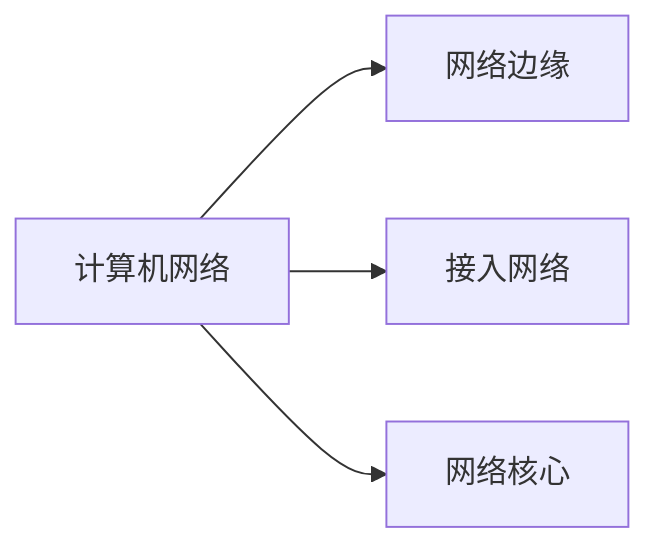

## 1.1 计算机网络

- **互连**的、**自治**的（无主从关系）计算机集合
- ISP：因特网服务提供商
- RFC（请求评论）：IETF的标准文档
- **Internet**
  - ISP网络互联的“网络之网络”（这个概念比较难以理解，要多翻阅大黑书，阅读里面的解释）
  - 数以百万计互连的计算设备的集合：主机（端系统）
  - 通信链路：光纤、铜缆、无线电、卫星……
  - 分组交换机：**路由器**和**链路层交换机**
  - 通信基础设施
  - 应用编程接口API
  - 协议
    - **三要素：语法、语义、时序**
- Internet结构
  - 

## 1.2 计算机网络结构

## 1.3 网络边缘

- 主机（端系统）
  - 客户/服务器应用模型（client/server）
  - 对等应用模型（P2P）
    - 无专用服务器、通信在对等实体之间直接进行（如QQ）

## 1.4 接入网络

- 将端系统<u>物理</u>连接到其边缘路由器的网络
1. 家庭接入
    - **数字用户线（DSL）**
      - 用已有的电话线连接本地中心局的DSLAM
      - 双绞铜线
      - *注*：上行速率指发送数据的速率；下行速率指接收数据的速率；一般下行要大于上行
    - **电缆网络**
      - HFC：混合光纤同轴电缆
      - 各家庭共享家庭至电缆头端(CMTS)的接入网络
    - **光纤到户（FTTH）**
      - 更高速率
    - 卫星链路
    - 拨号接入
2. 企业（和家庭）接入（局域网LAN）
    - **以太网**
      - 双绞铜线
    - **无线局域网（WLAN）**
      - WiFi
3. 广域无线接入（广域网WAN）
    - 通过蜂窝网接入（电信运营商），范围几十公里的基站
    - 3G、4G、LTE

## 1.5 网络核心

- 关键功能：**路由+转发**
  - 路由：确定分组从源到目的地的传输路径
  - 转发：将分组从路由器的输入端口交换至正确的输出端口
- 数据交换
  - **电路交换**
    - 典型案例：电话网络
    - 三个阶段：建立连接、通信、释放连接
    - 独占资源
    - 如何共享中继线？---**多路复用**(Muktiplexing)
      - <u>频分多路复用（FDM）</u>
        - 每个用户占用不同的频率带宽（Hz）
      - <u>时分多路复用（TDM）</u>
        - 每个用户占用TDM帧中的某个时隙
      - <u>波分多路复用（WDM）</u>
        - 实际上是光的频分复用
      - <u>码分多路复用（CDM）</u>
        - 广泛用于无线链路共享
        - 每个用户分配一个唯一的m bits码片序列（其中“-1”表示“0”；“+1”表示“1”），使用相同频率载波，各用户码片序列相互正交
        - 编码信号 = 原始数据 x 码片序列 &nbsp; $P=\sum_{i=1}^N {d_i S_i}$
        - 解码：$\frac 1m S_i P$
  - **报文交换**
    - 将整个报文一次性传输到路由器上
  - **分组交换**（统计多路复用）---按需共享链路
    - 将报文分拆成一系列相对较小的数据包
    - 与报文交换一样，均采用**存储-转发**的交换方式
    - :star:报文交付时间（报文Mbits；链路带宽Rbps；分组长度Lbits；跳步数h；路由器数n）
      - $T=\frac MR+(h-1)\frac LR$
      - $T=\frac MR+n\frac LR$

## 1.6 计算机网络性能

- **带宽**：数字信道所能传送的“最高数据率”（bps）

- **分组时延** **$d_{nodal} = d_{proc} + d_{queue} + d_{trans} + d_{prop}$**
  - **节点处理时延**（$d_{proc}$）
    - 确定链路、差错检测
  - **排队时延**（$d_{queue}$）
    - 等待输出链路可用
    - 取决于路由器的拥塞程度
  - **传输时延**（$d_{trans}$）
    - 分组的比特推向链路所需的时间
    - d~trans~ = L/R
  - **传播时延**（$d_{prop}$）
    - 从该链路的起点到达终点（下一个路由器）所需的时间
    - 取决于物理媒体和链路长度

*注：注意区分传输时延和传播时延*

- 流量强度 = La/R
  L：分组长度
  a：平均分组到达速率
  R：链路带宽
  - La/R ~ 0: 平均排队延迟很小
  - La/R ->1：平均排队延迟很大
  - La/R > 1：超出服务能力，平均排队延迟无限大

- **丢包**：分组到达已满队列将被丢弃
  - 队列缓存容量有限
  - 丢弃分组可能由前序节点或源重发（也可能不重发）

- **吞吐量**：表示在发送端与接收端之间的数据传输速率（bps）
  - 瞬时吞吐量、平均吞吐量
  - 瓶颈链路：端到端路径上，限制吞吐量的链路
  min{$R_{c}$ ，$R_{s}$}

- 时延带宽积 = 传播时延 x 带宽 = $d_{prop} \times R$ (bits)
（目前还未了解其具体含义）

## 1.7 计算机网络体系结构

- 分层结构
  - 计算机网络的各层及其协议的集合

### OSI参考模型

|层数|自顶向下|
|:---:|:---:|
|7|应用层|
|6|表示层|
|5|会话层|
|4|传输层|
|3|网络层|
|2|数据链路层|
|1|物理层|

1. 物理层
    - 接口特性、比特编码、数据率、比特同步、传输模式（单工、半双工、全双工）
2. 数据链路层
    - 负责结点-结点数据传输
    - <u>物理寻址</u>、组帧
    - 流量控制、差错控制、访问控制
3. 网络层
    - 负责源主机到目的主机数据分组交付（可能穿越多个网络）
    - <u>逻辑寻址</u>、路由
4. 传输层
    - <u>SAP寻址</u>（目前也不太清楚是个啥玩意）
    - 下列应该放在5层参考模型中
      - TCP协议---向它的应用程序提供了面向连接的服务
      - UDP协议---向它的应用程序提供无连接服务
5. 会话层
    - 对话控制、同步
6. 表示层
    - 数据压缩/解压、加密/解密、描述
7. 应用层
    - 支持用户通过用户代理（如浏览器）或网络接口使用网络（服务）
    - FTP、SMTP、HTTP

### TCP/IP参考模型

|层数|自顶向下|
|:---:|:---:|
|4|应用层|
|3|运输层|
|2|网际层|
|1|网络接口层|

### 5层参考模型

|层数|自顶向下|协议数据单元（PDU）|
|:---:|:---:|:---:|
|5|应用层|报文|
|4|传输层|报文段|
|3|网络层|数据报|
|2|链路层|帧|
|1|物理层|\\|

