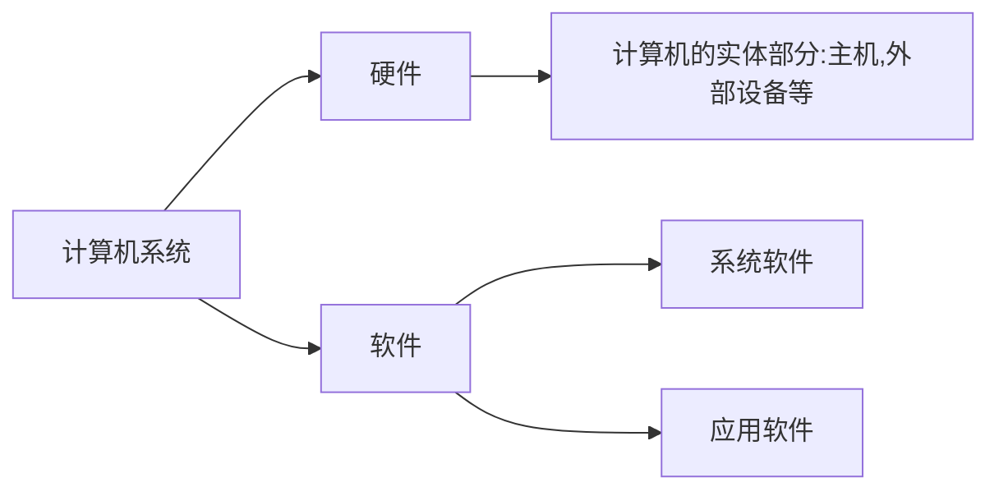

## 1.1 计算机的软硬件

## 1.2 计算机系统的层次结构

|层次|机器|解释|
|:--:|:--:|:--:|
|虚拟机器M4|高级语言机器|用编译程序翻译成汇编语言程序|
|虚拟机器M3|汇编语言机器|用汇编程序翻译成机器语言程序|
|虚拟机器M2|操作系统机器|用机器语言解释操作系统|
|传统机器M1|机器语言机器|用微程序解释机器指令|
|微程序机器M0|微指令系统|由硬件直接执行微指令|

## 1.3 计算机组成和计算机体系结构

|概念|区分|
|:--:|:--:|
|计算机体系结构(Architecture)|计算机系统的属性|
|计算机组成(Organization)|如何实现属性|

## 1.4 计算机基本组成

#### **冯·诺依曼计算机**

- 计算机由**运算器、存储器、控制器、输入设备和输出设备**五大部件组成
- 指令和数据以同等地位存放于存储器内，并可按地址寻访
- 指令和数据均用二进制表示
- 指令由操作码和地址码组成
- 指令在存储器内按顺序存放
- 以<u>运算器</u>为中心

#### **现代计算机**

- **主机**
  - **CPU(中央处理器)**
    - 运算器
      - ALU(算术逻辑单元)
      - ACC(累加器)
      - MQ(乘商计数器)
      - X(操作数寄存器)
    - 控制器
      - CU(控制单元)
      - IR(指令寄存器)
      - PC(程序计数器)---自动加1
  - **主存(MM)**
    - 存储体M
      - 由许多存储单元组成，每个存储单元又包含<u>若干个存储元件</u>（存储字，位数为存储字长）
    - MDR(存储器数据寄存器)
    - MAR(存储器地址寄存器)
    - 按地址访问存储器
    - 注：随着硬件技术的发展，主存都制成大规模集成电路的芯片，而将MAR和MDR集成在CPU芯片中
- **I/O设备**
- 注：整个工作步骤，参考课本；需记住<u>运算器中各寄存器所存放的各类操作数</u>

## 1.5 计算机硬件的主要技术指标
1. **机器字长**
    - CPU一次能处理数据的位数，通常与CPU的寄存器位数相关
    - 字长越长，数的表示范围越大，精度也越高
2. **总线宽度**
    - 数据总线一次能并行传输的最大二进制位数
3. **存储容量和存储带宽**
    - 存储容量：指一台计算机的主存/辅存所能存储的二进制信息的数量
      - 主存：= 存储单元个数 x 存储字长 = $2^m*n$
      - 辅存：例：500GB（字节数）
    - 存储带宽：单位时间内CPU与主存/辅存交换的二进制信息量（bps）
      - 影响因素：数据位宽和数据传输速率
4. **运算速度**
    - 影响因素：主频……
    - 计算方法：吉普森法
    - 衡量单位：MIPS(百万条指令每秒)、CPI(执行一条指令的时钟周期)、FLOPS(浮点运算次数每秒)

## 1.6 计算机的发展与应用

#### 计算机的产生和发展

|代|硬件技术|
|:--:|:--:|
|一|电子管|
|二|晶体管|
|三|中小规模集成电路|
|四|大规模集成电路|
|五|超大规模集成电路|

- 摩尔定律：微芯片上集成的晶体管数目每3年翻两番

#### 展望

- 光计算机
- DNA生物计算机
- 量子计算机
