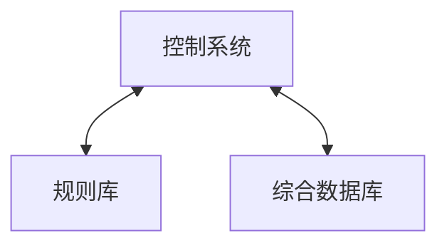

> 要使计算机具有智能，首先必须使它拥有知识<br>
> **知识的获取**、**知识的表示**和**运用知识进行推理**是人工智能学科研究的三个主要问题
{: .prompt-info }


## 1. 一阶谓词逻辑表示法

- 参照数理逻辑中的[命题逻辑](https://lreverse.github.io/posts/命题逻辑/)和[谓词逻辑](https://lreverse.github.io/posts/谓词逻辑/)


## 2. 产生式表示法

- 规则（产生式）
	- 确定性规则：IF P THEN Q
	- 非确定性规则：IF  P THEN Q (置信度)

#### 产生式系统



- **综合数据库DB**
	- 存放推理过程的各种当前信息
		- 如：初始状态、输入的事实、中间及最终结论
	- 作为推理过程选择可用规则的依据
- **规则库RB**
	- 存放推理所需要的所有规则，是整个产生式系统的知识集
- **控制系统**
	- 也称推理机，用于控制整个产生式系统的运行，决定问题求解过程的推理路线
- 流程：对于DB中的已知事实，利用可用规则进行推理，将会得到一个结论。若结论不是目标，将作为新的事实放入DB，成为以后推理的已知事实；若是目标，终止推理，同时给出问题的解的路径


## 3. 语义网络（Semantic Network）

- 通过概念及语义关系来表示知识的一种网络图，它是一个带标注的有向图
	- 语义基元：最基本的语义单元（节点1，弧，节点2）

#### 基本语义关系

1. 实例关系：ISA
	- “是一个”
2. 分类关系：AKO
	- “是一种”
3. 成员关系：A-Member-of
	- “是一员”
4. 聚类关系：Part-of
	- “是一部分”
5. 属性关系
	- Have：“有”
	- Can：“能”
6. 时间关系
	- Before、After
7. 位置关系
	- Located-at、Located-on....
8. 相近关系
	- similar-to
	- Near-to

#### 推理

- **继承**
	- 把对事物的描述从抽象节点传递到实例节点
	- 
- **匹配**
	- 在知识库的语义网络中寻找与待求解问题相符的语义网络模式
	- 


## 4. 知识图谱（Knowledge Graph）

- 本质上是一种**大规模语义网络**

#### RDF模型(Resourece Description Framework)

- 三元组：（主, 谓, 宾）
- 节点类型
  - URI
  - 字面量
    - 某些类型的值，例如整数、字符串等
  - 空白节点（匿名节点）
    - _:x

注：有亿点抽象，不太能理解这个模型

#### 典型知识图谱
- Cyc
	- 常识知识图谱，人工构建
- WordNet
	- 基于认知语言学的英语词典
- ConceptNet
	- 大型的多语言常识知识库
- GeoNames
	- 全球地理数据库
- Freebase/Wikidata
- DBpedia
	- 从维基百科页面中自动抽取出结构化的知识，构建而成的大型通用百科图谱
- YAGO
	- 采用自动的方式构建，数据来源于维基百科、WordNet以及GeoNames
- BabelNet
	- 多语言知识图谱
- Google KG
- Probase
	- 概念图谱，数据源来自Bing的网页，主要利用Hearst Pattern从文本中抽取ISA关系
- 搜狗知立方/百度知心
	- 中文知识图谱，应用于各自的搜索引擎


## 5. 框架表示法

- 框架：人们认识事物的一种通用的数据结构形式
  - 一个框架由若干个槽组成，每个槽又划分为若干个侧面
	  - 一个槽：描述对象的一个方面属性
	  - 一个侧面：描述相应属性的一个方面
```
Frame<框架名>
	槽名A: 侧面名A1 值A11, 值A12……
		   侧面名A2 值A21, 值A22……
	槽名B: 侧面名B1 值B11, 值B12……
		   侧面名B2 值B21, 值B22……
```

- 预定义槽名AKO：“是一种”
	- 作为下层框架的槽名时，其槽值为上层框架的框架名，表示该下层框架所描述的事物比其上层框架更具体。并且，由AKO所联系的框架之间具有属性的继承关系
```
杨叶，女，计算机专业，参加了导师林海的网络智能研究方向的省部级项目
Frame <Master-1>
    ISA: <Master>  //是一个
    Name: Yang, Ye
    Sex: female
    Major: Computer
    Field: Web-Intelligence//方向Web智能
    Advisor: Lin Hai  //导师林海
    Project: Provincial  //项目省部级
```
- 基本结构
	- 纵向联系
		- 具有继承关系的上下层框架之间的联系
		- 槽名AKO和ISA实现
	- 横向联系
		- 另一个框架名作为一个槽的槽值或侧面值所建立起来的框架之间的联系
- 问题求解过程---匹配和填槽
	- 通过对相应槽的槽名和槽值逐个进行比较，并利用继承关系来实现的

